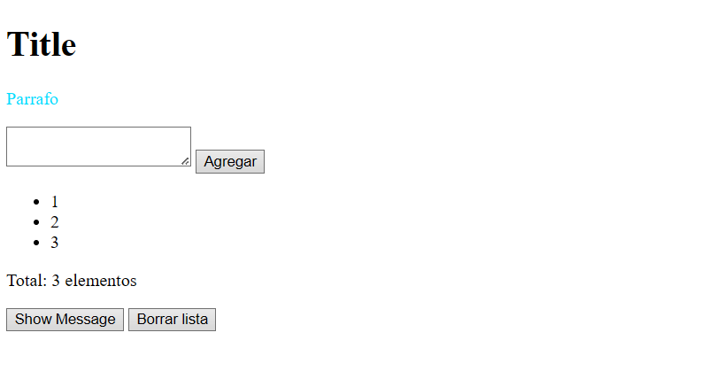
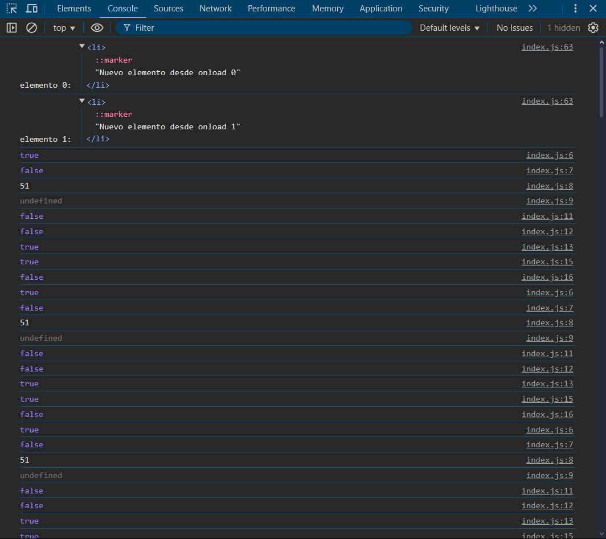

# Proyecto: Introducción al DOM

## 📄 Descripción General
Este proyecto es una práctica de manipulación del **DOM** usando HTML, CSS básico y JavaScript.
Se implementan:
- Creación y modificación de elementos del DOM.
- Manejo de eventos.
- Validaciones de contenido.
- Contadores dinámicos.
- Borrado de elementos.

## 🔹 Estructura de Archivos
```
01_introduccion_dom/
├── index.html
└── index.js
```

## 🔹 Tecnologías usadas
- HTML5
- JavaScript (ES6)

---

## 👥 Renzo fernando Mossquera Daza
- A00401681

---

# 📅 Explicación de Funcionalidades

### 1. Agregar elementos a una lista
El usuario escribe en un textarea y presiona "Agregar" para insertar nuevos elementos (`<li>`) en una lista.

### 2. Evitar elementos repetidos
Si el valor ya existe en la lista, muestra un `alert("Ese valor ya existe en la lista.")`.

### 3. Contador de elementos
Se actualiza el total de elementos de la lista en tiempo real.

### 4. Borrar lista completa
Al presionar "Borrar lista", se elimina todo el contenido de la lista.

### 5. Cambiar color del párrafo
Al hacer clic en el párrafo, cambia el color del texto.

### 6. Limpiar textarea si se escribe la letra "x"
Si el usuario escribe la letra `x` en el campo de texto, el contenido se limpia automáticamente.

---

# 📗 Capturas de Pantalla

## Vista Principal:


## Consola de Navegador:



---

# 📅 Conceptos Clave

## 📖 ¿Qué es el DOM?
El **DOM (Document Object Model)** es una representación estructurada de una página web como un árbol de nodos. Permite a JavaScript acceder y manipular el contenido, estructura y estilo del documento.

## 📖 ¿Qué es window.onload?
`window.onload` es un evento que se ejecuta cuando toda la página y sus recursos (imágenes, scripts, estilos) han terminado de cargarse. Es útil para asegurarte de que los elementos existan antes de manipularlos con JavaScript.

```javascript
window.onload = () => {
    // Tu código aquí
};
```

## 📖 Diferencia entre innerText e innerHTML
| Propiedad     | Descripción                                   | Ejemplo                                |
|---------------|-----------------------------------------------|----------------------------------------|
| `innerText`   | Devuelve o cambia el **texto visible**         | `p.innerText = "Hola"`                  |
| `innerHTML`   | Devuelve o cambia el **contenido HTML interno**| `p.innerHTML = "<strong>Hola</strong>"` |

## 📖 ¿Qué hacen createElement() y appendChild()?
- `createElement("li")`: Crea un nuevo nodo HTML (`<li>`) en memoria.
- `appendChild()`: Inserta ese nodo en el DOM dentro de un elemento existente.

```javascript
const item = document.createElement("li");
item.textContent = "Nuevo";
document.getElementById("listElements").appendChild(item);
```

---

# 🔗 Código de las Principales Funcionalidades

## Fragmento de JavaScript:
```javascript
function addTextToList() {
    const list = document.getElementById("listElements");
    const text = document.getElementById("inputText");
    const value = text.value.trim();

    if (value !== "") {
        const items = list.querySelectorAll("li");
        const exists = Array.from(items).some(item => item.textContent === value);

        if (exists) {
            alert("Ese valor ya existe en la lista.");
            return;
        }

        const item = document.createElement("li");
        item.textContent = value;
        list.appendChild(item);
        text.value = "";
        updateCounter();
    }
}

function clearList() {
    const list = document.getElementById("listElements");
    list.innerHTML = "";
    updateCounter();
}

function updateCounter() {
    const list = document.getElementById("listElements");
    const total = list.querySelectorAll("li").length;
    document.getElementById("counter").textContent = `Total: ${total} elemento${total !== 1 ? 's' : ''}`;
}
```

---

# 🔗 Conclusión
Este proyecto permite comprender cómo JavaScript interactúa con el DOM para crear experiencias web dinámicas, úciles de modificar, y mucho más responsivas para el usuario.

---

# 🎉 Fin del Proyecto `01_introduccion_dom` ✅