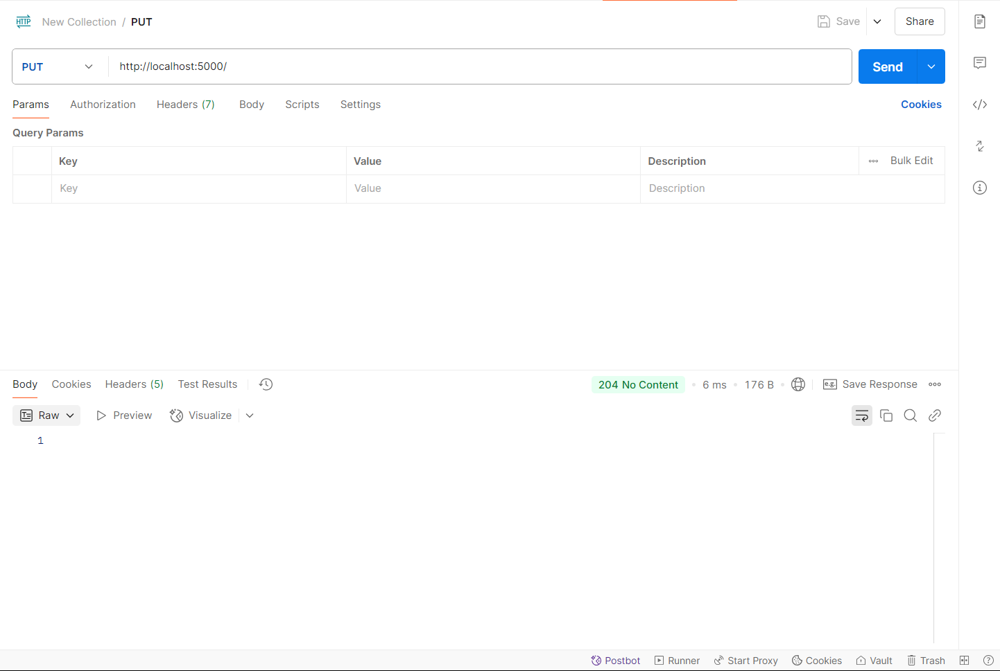
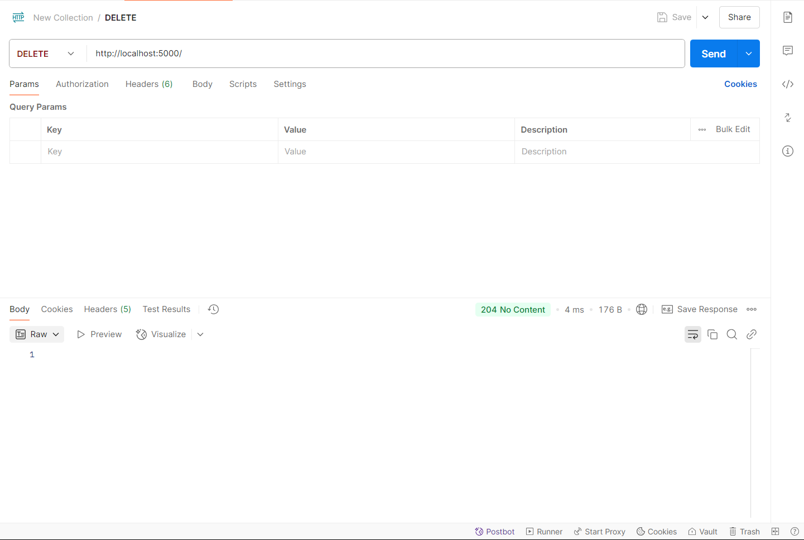
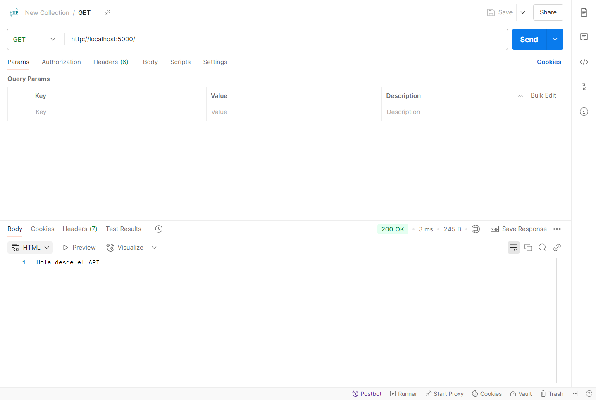
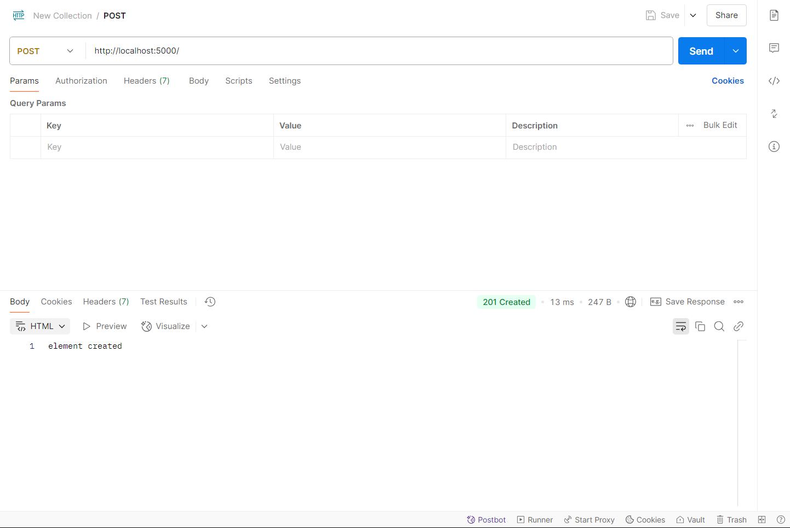

# Taller API REST con Node.js

Este documento registra los pasos realizados durante el desarrollo del proyecto `02_apirest` como parte del curso de Computación en Internet. A continuación, se muestran las evidencias con capturas tomadas durante el proceso.

---

## 1. Pruebas básicas del API REST

### GET
Se realizó una prueba básica del endpoint raíz utilizando Postman:

### POST
Prueba de creación de un recurso en el endpoint raíz:

### PUT
Simulación de una actualización sin contenido:

### DELETE
Prueba de borrado sin contenido:

---

## 2. Modularización: `control/user.js`

Implementación de funciones de controlador para usuarios, con consola mostrando el `req.body`:

---

## 3. CRUD de usuarios conectados a JSON local

Se implementó una base de datos local usando `database.json` y se realizaron pruebas en Postman para cada método:

### GET - Obtener todos los usuarios

### GET - Obtener un usuario por ID

### GET - Obtener el mismo usuario nuevamente (verificación)

### POST - Crear usuario desde Postman

### PUT - Editar usuario

### DELETE - Eliminar usuario

---

## 4. Backend del proyecto - Código final

Visual Studio Code con el controlador final implementado (métodos, excepciones, manejo de errores, uso de `fs`, etc.):

---

## 5. Interfaz cliente web

Aplicación final cargando correctamente desde el archivo `client/index.html`:

---

## Conclusión

Se completó exitosamente la implementación de un API REST en Node.js utilizando módulos, controladores, persistencia en archivos JSON, manejo de errores y una interfaz web sencilla. Todas las pruebas de los métodos GET, POST, PUT y DELETE fueron ejecutadas desde Postman y el navegador, con registros en consola y respuestas HTTP apropiadas.

